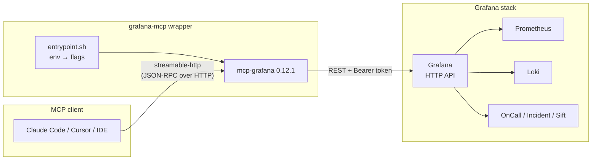
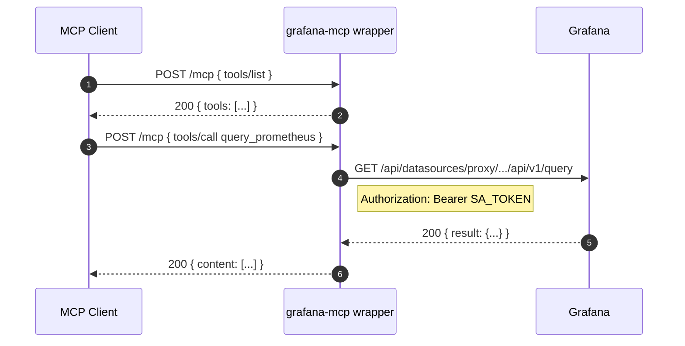
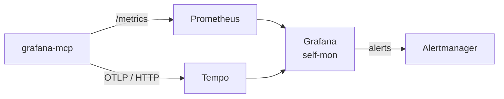
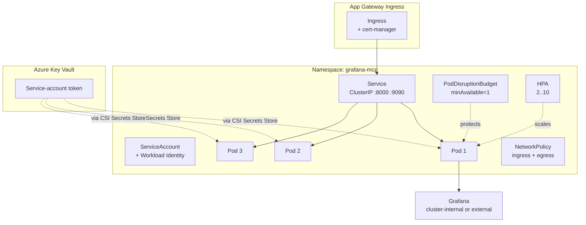

# Architecture

`grafana-mcp` is a **wrapper** around the upstream Grafana MCP server. It does
not reimplement the protocol or the Grafana client. Its job is to make the
upstream binary boring to deploy: pinned image, sane defaults, hardened
container, opinionated K8s manifests, and a regression suite that proves the
MCP surface still does what we expect after each upstream bump.

## High-level component view

## Transport modes

| Mode | When to use | Notes |
|---|---|---|
| `stdio` | Direct integration with a single AI client (e.g. Claude Code launching the binary as a subprocess). | No HTTP listener; no `/healthz`; no `/metrics`. |
| `sse` | Long-lived streaming sessions when you need server-pushed events. | Listens on `--address`, exposes `/sse`. |
| `streamable-http` *(default)* | Container/Kubernetes deployments. Multi-client. | HTTP at `--address`, MCP at `/mcp`, `/healthz`, `/metrics`. |

The wrapper defaults to **streamable-http** because the entire deploy story
(Compose, K8s) assumes an HTTP listener with a probeable health endpoint.

## Request flow

## Auth flow

1. A Grafana administrator creates a **dedicated service account** with
   the minimum role required by the tools they expose.
2. A token is minted on that service account and placed into the env var
   `GRAFANA_SERVICE_ACCOUNT_TOKEN` (or, in K8s, mounted from a `Secret` /
   `SecretProviderClass`).
3. Every Grafana REST call from the MCP server uses
   `Authorization: Bearer <token>`.
4. With `GRAFANA_ORG_ID` set, all calls are scoped to that organisation.
5. With `GRAFANA_FORWARD_HEADERS` set, an HTTP MCP client can pass
   per-request overrides (e.g. `X-Grafana-Org-Id`) without re-minting tokens.

## Multi-org behaviour

A single MCP server can serve multiple Grafana organisations:

- Pin a default org with `GRAFANA_ORG_ID`.
- Allow client overrides by listing `X-Grafana-Org-Id` (or other) in
  `GRAFANA_FORWARD_HEADERS`. Without this allowlist, MCP ignores client
  headers — preventing accidental privilege grants.

## Observability path

- Prometheus instrumentation: `mcp_server_session_duration_seconds`,
  `mcp_server_operation_duration_seconds`, plus Go runtime stats.
  Scraped via the `ServiceMonitor` shipped under `k8s/base/`.
- Tracing: standard `OTEL_EXPORTER_OTLP_*` env vars route spans to your
  collector or Tempo directly.
- Self-monitoring dashboard JSON is exported under `docs/` once stable.

## Production deployment topology (AKS)

Key points:

- **Pod identity** uses Azure Workload Identity → access to Key Vault.
- **Secret** (the service-account token) lives in Key Vault and is mounted
  via the Secrets Store CSI Driver. The K8s `Secret` is the dev fallback only.
- **Network policy** restricts ingress to namespaces that label themselves
  `mcp-client=true`, and egress to the Grafana endpoint + DNS.
- **Replicas: 3** spread by zone via `topologySpreadConstraints`. PDB keeps
  at least one Pod up during voluntary disruption.
- **HPA** scales between 2 and 10 on CPU + memory; a custom-metric example
  is included (commented) for `mcp_server_operation_duration_seconds`.
- **Probes**: `/healthz` is used for both liveness and readiness. The
  upstream returns `200 ok` only when the listener is fully bound and ready.

## What this wrapper deliberately does NOT do

- Implement MCP protocol features (use upstream).
- Add tools (use upstream's plugin paths if/when they exist).
- Cache or proxy Grafana responses (would diverge state).
- Authenticate end users (the MCP client is trusted; AuthN happens at the
  ingress / mesh layer).
