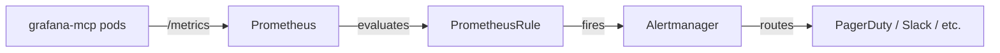

# Alerts reference

Every alert shipped in [`k8s/base/prometheusrule.yaml`](../k8s/base/prometheusrule.yaml),
keyed by name. Each entry lists when the alert fires, common root causes,
the tuning knob, and the runbook anchor on-call should open first.

## Wiring



The `PrometheusRule` is picked up by Prometheus Operator if its
`ruleSelector.matchLabels` includes `release: prometheus` (the default
label we ship). Confirm:

```bash
kubectl -n monitoring get prometheus -o yaml | yq '.items[].spec.ruleSelector'
```

## Severity ladder

| Severity | Meaning | Routing default |
|---|---|---|
| `critical` | User-visible impact or imminent outage. Page on-call. | PagerDuty + Slack `#mcp-incidents` |
| `warning` | Degradation; investigate within a business day. | Slack `#mcp-incidents` only |
| `info` | Informational, no action required by default. | Slack `#mcp-noise` |

## Catalogue

### GrafanaMcpDown — `critical`

```promql
up{job=~".*grafana-mcp.*"} == 0
for: 5m
```

**Fires when:** Prometheus can't scrape `grafana-mcp:9090/metrics`, or
the readiness probe fails consistently for 5 minutes.

**Common causes:** image-pull failure after a tag bump, NetworkPolicy
regression blocking the monitoring namespace, the pod stuck in
`CrashLoopBackOff`, Grafana itself unreachable so `/healthz` won't return
ready.

**Action:** `runbook.md` → [#mcp-down](runbook.md#mcp-down). Roll back if
the alert came in within 10 min of a deploy.

**Tuning:** `for: 5m` is conservative — drop to `2m` if you need faster
paging.

---

### GrafanaMcpRestartingRepeatedly — `warning`

```promql
increase(kube_pod_container_status_restarts_total{namespace="grafana-mcp"}[15m]) > 3
```

**Fires when:** Any pod restarts more than 3 times in 15 minutes.

**Common causes:** OOMKill (bump `resources.limits.memory`), config
parse error in a recent ConfigMap change, expired service-account token
causing repeated panic, livenessProbe too aggressive vs Grafana
upstream slowness.

**Action:** `runbook.md` → [#crashloop](runbook.md#crashloop).

---

### GrafanaMcpHighOperationLatencyP95 — `warning`

```promql
histogram_quantile(
  0.95,
  sum by (le, mcp_method_name) (
    rate(mcp_server_operation_duration_seconds_bucket{namespace="grafana-mcp"}[5m])
  )
) > 5
for: 10m
```

**Fires when:** Any individual MCP method's p95 latency exceeds 5 s for
10 minutes.

**Common causes:**
- Upstream Grafana is slow (check `GrafanaMcpUpstreamGrafanaSlow`
  alongside).
- A specific tool category was just enabled and the underlying datasource
  is slow (e.g. wide PromQL ranges, large Loki queries).
- HPA hasn't scaled yet — check `mcp_sessions_active`.

**Tuning:** raise the threshold if your environment legitimately has
slow Grafana queries — 5 s is the SLO target for typical observability
stacks.

---

### GrafanaMcpHighOperationLatencyP99 — `critical`

Same shape as P95 with `0.99` and threshold 15 s. Pages because at p99
> 15 s, MCP clients are visibly hanging.

---

### GrafanaMcpHigh5xxRate — `warning`

```promql
sum(rate(http_server_request_duration_seconds_count{
  namespace="grafana-mcp",
  http_response_status_code=~"5.."
}[5m]))
/
sum(rate(http_server_request_duration_seconds_count{namespace="grafana-mcp"}[5m]))
> 0.05
for: 10m
```

**Fires when:** ≥ 5 % of HTTP responses are 5xx for 10 minutes.

**Why HTTP, not MCP-level:** the MCP-specific
`mcp_server_operation_duration_seconds` metric does not carry a status
label, so we measure error rate at the HTTP transport boundary instead.
This catches both MCP protocol errors and Grafana-proxying failures.

**Common causes:** expired service-account token (look for `401`s in
logs), Grafana 5xxs being relayed through, a datasource type whose
plugin was uninstalled mid-flight.

**Action:** `runbook.md` → [#errors](runbook.md#errors).

---

### GrafanaMcpUpstreamGrafanaSlow — `warning`

```promql
histogram_quantile(
  0.95,
  sum by (le) (
    rate(http_client_request_duration_seconds_bucket{namespace="grafana-mcp"}[5m])
  )
) > 5
for: 10m
```

**Fires when:** outbound MCP → Grafana p95 stays above 5 s for 10 min.

**Why:** when upstream Grafana itself is slow, MCP latency rises in
lock-step. This alert fires *before* the MCP-level latency alert and
points the on-call straight at Grafana.

**Action:** check Grafana's own dashboards before chasing MCP. If
Grafana looks fine, suspect network egress saturation between MCP and
Grafana (NetworkPolicy, NodePool, Azure NAT gateway).

---

### GrafanaMcpMemoryPressure — `warning`

```promql
container_memory_working_set_bytes{namespace="grafana-mcp",container="mcp"}
/
container_spec_memory_limit_bytes{namespace="grafana-mcp",container="mcp"}
> 0.85
for: 10m
```

**Fires when:** working set exceeds 85 % of the container memory limit.

**Common causes:** sustained high concurrent session count, a long-tail
of aggressive Loki/Prometheus queries, or genuinely under-provisioned
limits.

**Action:** `runbook.md` → [#oom](runbook.md#oom). Bump
`resources.limits.memory` in the dev overlay first to validate, then
update base.

---

### GrafanaMcpHpaMaxedOut — `warning`

```promql
kube_horizontalpodautoscaler_status_current_replicas{namespace="grafana-mcp"}
>=
kube_horizontalpodautoscaler_spec_max_replicas{namespace="grafana-mcp"}
for: 15m
```

**Fires when:** HPA has been at `maxReplicas` for ≥ 15 minutes.

**Common causes:** legitimate sustained load (raise `maxReplicas`),
runaway client (one MCP user pinning all the calls — investigate via
the Tools dashboard's top-N method panel), or a memory leak preventing
single-pod throughput from recovering after a load spike.

---

### GrafanaMcpHighSessionConcurrency — `info`

```promql
sum(mcp_sessions_active{namespace="grafana-mcp"}) > 200
for: 5m
```

**Fires when:** > 200 concurrent MCP sessions for 5 minutes.

**Why info-only:** healthy until proven otherwise — this is a heads-up
to validate that capacity sizing assumed the current concurrency.

**Tuning:** `MCP_SESSION_IDLE_TIMEOUT_MINUTES` (default 30) is the
biggest lever — lowering it reaps idle sessions faster. The threshold
in the alert (`> 200`) should track your real concurrency budget.

## Silencing during planned maintenance

```bash
amtool silence add \
  --comment "scheduled MCP upgrade $(date +%Y-%m-%d)" \
  --duration 2h \
  alertname=~"GrafanaMcp.*" namespace="grafana-mcp"
```

Make every silence:
- time-bounded (no open-ended)
- annotated with a ticket / change-management id
- reviewed weekly via `amtool silence query`

## Adding a new alert

1. Edit [`k8s/base/prometheusrule.yaml`](../k8s/base/prometheusrule.yaml).
2. Document it here and link to a new runbook section.
3. Validate with `kubectl kustomize k8s/overlays/dev | kubeconform -strict`.
4. Test the expression in Prometheus's UI against historical data
   before merging.
5. Open a PR. The CI workflow's `k8s-validate` job re-renders all
   overlays.

## Removing an alert

Don't. Disable the route in Alertmanager instead, observe for a
quarter, then remove from the rule file. Removed alerts are a common
post-incident regret.
