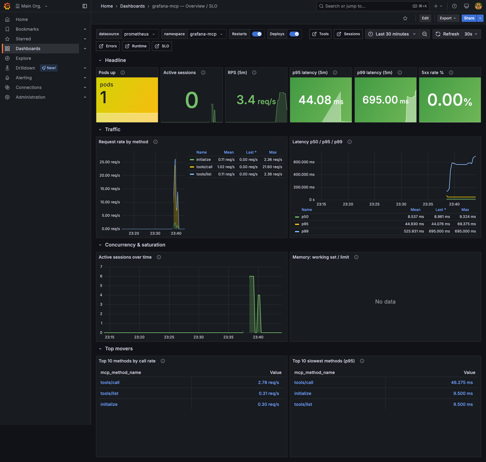
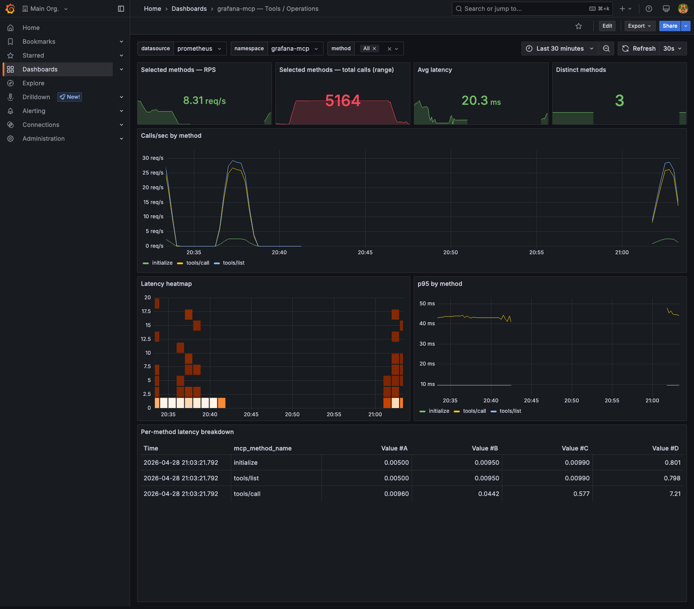
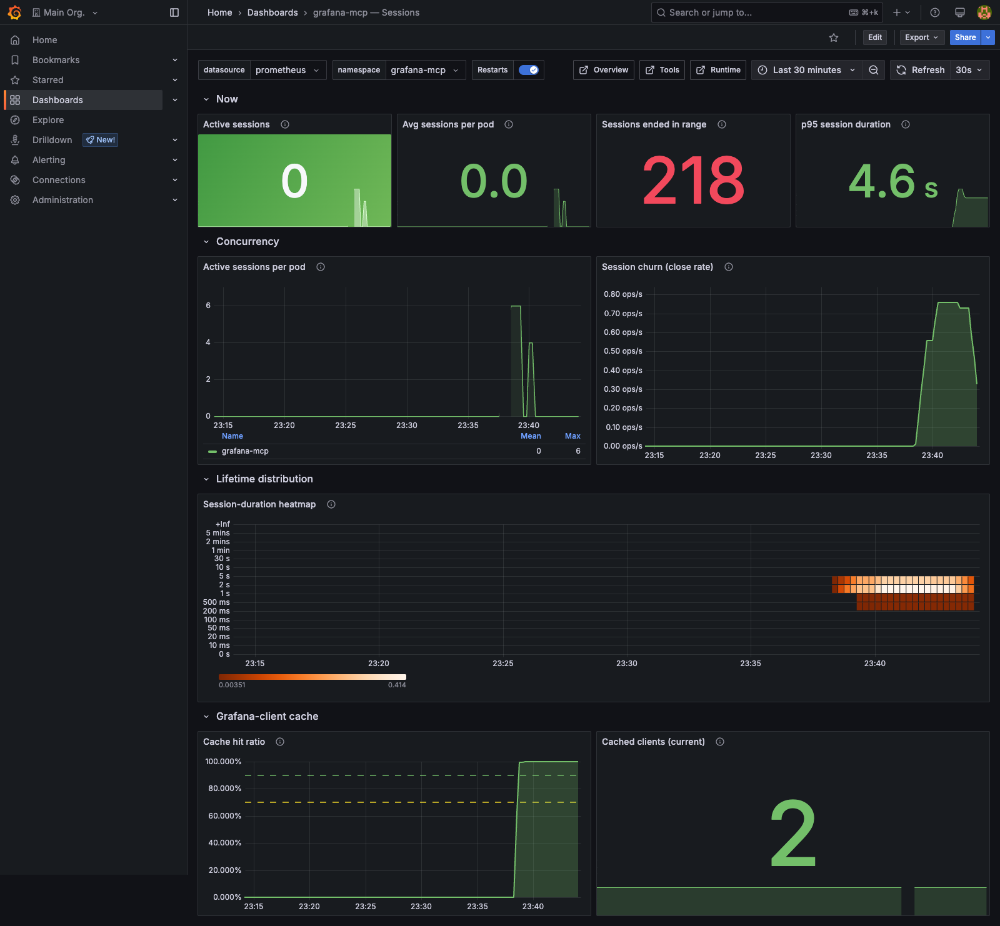
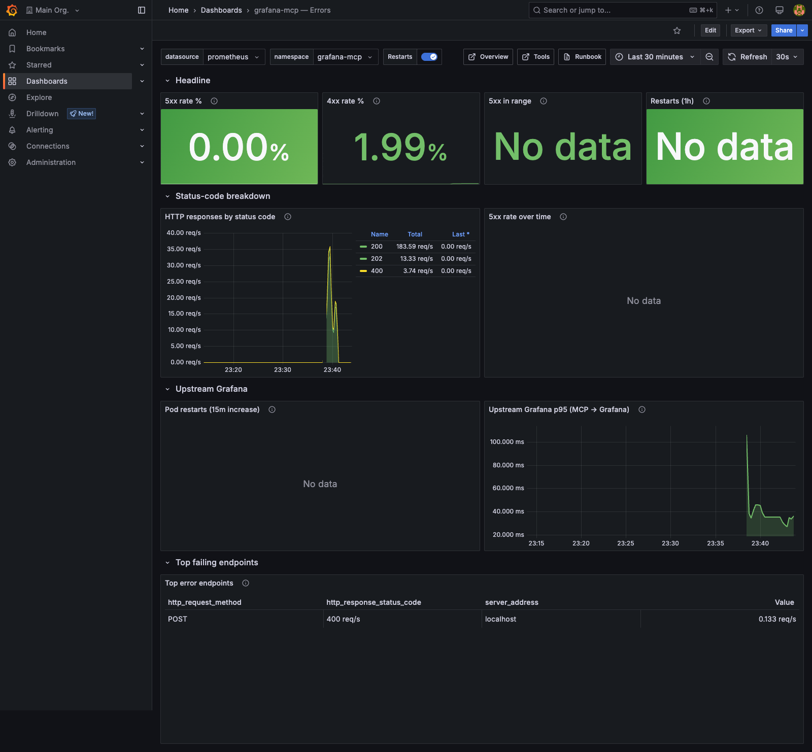
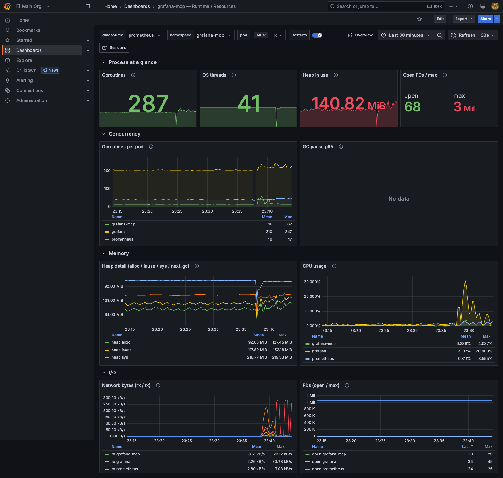

# Dashboards

Production-grade Grafana dashboards for the MCP server. Import any of the
JSON files into your Grafana — they all assume a Prometheus datasource
that scrapes the [`ServiceMonitor`](../../k8s/base/servicemonitor.yaml)
shipped with this repo (or any Prometheus reachable on `/metrics`).

## What's here

| File | Title | UID | Panels | Audience |
|---|---|---|---:|---|
| [`grafana-mcp-overview.json`](grafana-mcp-overview.json) | Overview / SLO | `grafana-mcp-overview` | 16 | First page on-call opens during an incident |
| [`grafana-mcp-tools.json`](grafana-mcp-tools.json) | Tools / Operations | `grafana-mcp-tools` | 12 | Per-tool latency / RPS drill-down |
| [`grafana-mcp-sessions.json`](grafana-mcp-sessions.json) | Sessions | `grafana-mcp-sessions` | 13 | Concurrency, session lifetime, client cache |
| [`grafana-mcp-errors.json`](grafana-mcp-errors.json) | Errors | `grafana-mcp-errors` | 13 | 4xx/5xx, restarts, upstream latency |
| [`grafana-mcp-runtime.json`](grafana-mcp-runtime.json) | Runtime / Resources | `grafana-mcp-runtime` | 14 | Goroutines, GC, heap, CPU, FDs |
| [`grafana-mcp-slo.json`](grafana-mcp-slo.json) | SLO / Error budget | `grafana-mcp-slo` | 18 | SLO posture for execs + multi-window burn rate |

All dashboards share:

- **Cross-dashboard navigation** — every dashboard has links to the
  others in its top-right; key panels deep-link via the `links` field.
- **Annotations** — pod restarts and deploys (when running on K8s with
  kube-state-metrics) appear as vertical bars across every time-series.
- **Alert-aligned thresholds** — colours and dashed reference lines
  match the rules in [`k8s/base/prometheusrule.yaml`](../../k8s/base/prometheusrule.yaml)
  and the catalogue in [`docs/alerts.md`](../alerts.md).
- **Hover tooltips** — every panel has a `description` so an unfamiliar
  reader gets context without leaving the dashboard.

## Importing

```bash
GRAFANA=http://grafana.example
TOKEN=glsa_...

for f in docs/dashboards/*.json; do
  curl -fsS -H "Authorization: Bearer $TOKEN" \
       -H "Content-Type: application/json" \
       -X POST "$GRAFANA/api/dashboards/db" \
       -d "$(jq -n --slurpfile dash "$f" \
              '{dashboard: $dash[0], overwrite: true, folderId: 0}')"
  echo
done
```

Or via UI: **Dashboards → Import → Upload JSON file**.

If you're running the local Compose stack with the `local-grafana`
profile, the dashboards are **auto-loaded** — `compose/provisioning/`
mounts this directory into Grafana at `/var/lib/grafana/dashboards`.

## SLO dashboard variables

The SLO dashboard takes three constants you can edit at the top of the
page:

| Variable | Default | What it controls |
|---|---|---|
| `availability_target` | `99.9` | The availability SLO (in %) used to compute error-budget remaining and burn rate. |
| `latency_target_seconds` | `5` | The p95 latency SLO threshold. |
| `errors_target_pct` | `1` | The 5xx error-rate budget over the 30-day window. |

Tune these to your team's actual commitment.

## Required metrics

All dashboards filter by `namespace="$namespace"`. In a Kubernetes
deployment, kube-prometheus-stack populates this label automatically.
For the local Compose stack, the same effect is achieved by static
labels in [`compose/prometheus/prometheus.yml`](../../compose/prometheus/prometheus.yml).

The metric catalogue is at [`docs/metrics.md`](../metrics.md).

## Live previews

These screenshots are captured by
[`tests/e2e/test_dashboards_playwright.py`](../../tests/e2e/test_dashboards_playwright.py)
against the local LGTM stack with 90 s of sustained MCP load
(see [`tests/fixtures/drive_load.py`](../../tests/fixtures/drive_load.py)).
Re-run with `make test-dashboards`.

### Overview / SLO

Top-level health: pods up, RPS, p95/p99 latency, 5xx %, top-N tools.



### Tools / Operations

Per-method drill-down: calls/sec by method, latency heatmap, p95 by
method, full p50/p95/p99 + RPS table.



### Sessions

Active sessions, churn rate, session-duration heatmap, Grafana-client
cache hit ratio.



### Errors

5xx/4xx rates, status-code stack, pod restarts, upstream Grafana
latency, top-N error endpoints. (5xx panels are correctly empty in a
healthy local run — they only light up during real incidents.)



### Runtime / Resources

Goroutines, GC pauses, heap detail, CPU, network bytes, file
descriptors.



## Why some panels say "No data" locally

| Panel | Reason | Where it lights up |
|---|---|---|
| `Memory: working set / limit` | Uses `container_memory_working_set_bytes` from cAdvisor | Real K8s cluster |
| `Pod restarts (15m increase)` / `Restarts (1h)` | Uses `kube_pod_container_status_restarts_total` from kube-state-metrics | Real K8s cluster |
| `5xx rate %` / `5xx in range` / `5xx rate over time` | Healthy local stack → 0 5xx responses | Production (during incidents) |
| `Top error endpoints` | `topk()` over an empty set renders as no-data | Production with errors |
| `GC pause p95` | `go_gc_duration_seconds{quantile="0.95"}` only emits after the first GC cycle | After ~30 s of sustained allocation |
| SLO dashboard error-budget panels | Need ≥ 30 d of `up` history to fill the rolling window | Long-running production |
